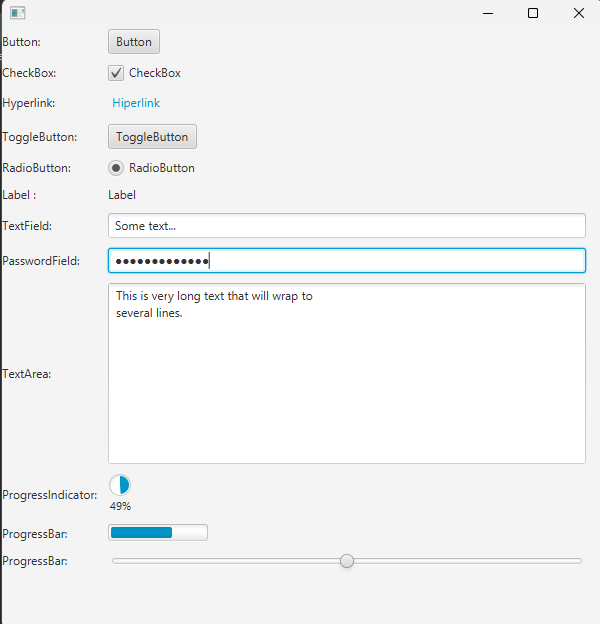

# Proyecto Interfaz Button
En este proyecto se presenta la interfaz con botton y text como practica formulario en JavaFx
## Imagen Interfaz
.
### Button
Un botón en JavaFX es un control de interfaz de usuario que permite a los usuarios interactuar con una aplicación. Al hacer clic en un botón, se puede desencadenar una acción, como abrir una nueva ventana, mostrar un mensaje o ejecutar una función.

     Button button = new Button("Button");       
### CheckBox
Un CheckBox en JavaFX es un control de interfaz de usuario que permite a los usuarios seleccionar o deseleccionar una opción. Por lo general, aparece como un cuadro cuadrado que muestra una marca de verificación cuando se selecciona y permanece vacío cuando se anula la selección. Además, JavaFX ofrece una funcionalidad de tres estados para casillas de verificación.

    CheckBox checkBox = new CheckBox("CheckBox");
### Hyperlink
En JavaFX, un hipervínculo es un control de interfaz de usuario que se asemeja a una etiqueta de estilo HTML con la capacidad de responder a las interacciones del usuario, como desplazamientos del mouse y clics. Por lo general, muestra texto o una combinación de texto y una imagen y, cuando se hace clic, desencadena una acción, como abrir una página web o ejecutar una función específica.

    Hyperlink hyperlink = new Hyperlink("Hiperlink");
### ToggleButton
Un ToggleButton en JavaFX es un control de interfaz de usuario que permite a los usuarios seleccionar o deseleccionar una opción, similar a una casilla de verificación. Por lo general, se parece a un botón con una etiqueta de texto y un estado asociado, ya sea seleccionado o no seleccionado. A diferencia de un botón normal, un ToggleButton mantiene su estado hasta que el usuario lo activa explícitamente o mediante programación.

     ToggleButton toggleButton = new ToggleButton("ToggleButton");
### RadioButton

Un RadioButton en JavaFX es un control de interfaz de usuario que se utiliza para presentar un grupo de opciones mutuamente excluyentes donde solo se puede realizar una selección a la vez. Por lo general, aparece como un botón circular con una etiqueta de texto y se comporta de manera similar a un botón de opción en un formulario físico.

    RadioButton radioButton = new RadioButton("RadioButton"); 
### Label
Una label en JavaFX es un control de texto no editable que se utiliza para mostrar un breve fragmento de texto o una imagen dentro de una aplicación JavaFX. Es un elemento básico de la interfaz de usuario que sirve para presentar información al usuario.

     Label label = new Label("Label");
### TextField
Un TextField en JavaFX es un control de interfaz de usuario que permite a los usuarios ingresar una sola línea de texto. Es un elemento fundamental para recopilar la información del usuario dentro de su aplicación.

     TextField textField = new TextField("Some text...");
### PasswordField
Un campo de contraseña en JavaFX es un control de interfaz de usuario diseñado específicamente para ingresar y mostrar contraseñas. Enmascara los caracteres ingresados ​​por el usuario, asegurando que la contraseña permanezca oculta a la vista. Esto es crucial para proteger información confidencial como contraseñas.

     PasswordField passwordField = new PasswordField();
### TextArea
Un TextArea en JavaFX es un control de interfaz de usuario que permite a los usuarios ingresar y editar múltiples líneas de texto sin formato. Es un componente versátil para mostrar y recopilar información basada en texto dentro de su aplicación JavaFX.

     TextArea textArea = new TextArea("This is very long text that will wrap to\nseveral lines.");
### ProgressIndicator
Un ProgressIndicator en JavaFX es un control de interfaz de usuario que representa visualmente el progreso de una tarea u operación. Es un indicador circular que se llena de color a medida que avanza el progreso, brindando a los usuarios una señal visual sobre el estado de un proceso de larga duración.

     ProgressIndicator ProgressIndicator = new ProgressIndicator(0.49);
### ProgressBar
Una ProgressBar en JavaFX es un indicador visual que se utiliza para representar el progreso de una tarea u operación en curso dentro de su aplicación. Proporciona a los usuarios comentarios sobre la etapa actual y el tiempo restante estimado para su finalización.

    ProgressBar progressBar = new ProgressBar(0.67); 
### Slider
Un control deslizante en JavaFX es un control de interfaz de usuario que permite a los usuarios seleccionar un valor numérico de un rango continuo.Por lo general, consta de una pista y un pulgar que se puede arrastrar y que el usuario puede mover para indicar el valor deseado.Los controles deslizantes se usan comúnmente para configuraciones,ajustes,y entrada dentro de las aplicaciones.

    Slider slider = new Slider(0, 100, 50);
## GridPane
GridPane es un administrador de diseño en JavaFX que organiza sus elementos secundarios dentro de una cuadrícula flexible de filas y columnas. Es un diseño potente y versátil para crear interfaces de usuario complejas con una disposición estructurada de componentes.

    GridPane gridPane = new GridPane();
	        gridPane.setHgap(10);
	        gridPane.setVgap(10);
	        gridPane.setAlignment(Pos.TOP_LEFT);

	        gridPane.add(botton, 0, 0);
	        gridPane.add(button, 1, 0);
	        gridPane.add(check, 0, 1);
	        gridPane.add(checkBox, 1, 1);
	        gridPane.add(hyper, 0, 2);
	        gridPane.add(hyperlink, 1, 2);
	        gridPane.add(Toggle, 0, 3);
	        gridPane.add(toggleButton, 1, 3);
	        gridPane.add(Radio, 0, 4);
	        gridPane.add(radioButton, 1, 4);
	        gridPane.add(label1, 0, 5);
	        gridPane.add(label, 1, 5);
	        gridPane.add(Text, 0, 6);
	        gridPane.add(textField, 1, 6);
	        gridPane.add(Password, 0, 7);
	        gridPane.add(passwordField, 1, 7);
	        gridPane.add(text, 0, 8);
	        gridPane.add(textArea, 1, 8);
	        gridPane.add(progress, 0, 9);
	        gridPane.add(ProgressIndicator, 1, 9);
	        gridPane.add(Progress, 0, 10);
	        gridPane.add(progressBar, 1, 10);
	        gridPane.add(Slider, 0, 11);
	        gridPane.add(slider, 1, 11);
